# shr0ud_kill3r
Generative model to produce optical satellite images from SAR images.

Cloud cover in satellite images is a major problem, causing either loss of information through obstruction (thick clouds), or blurry effects (semi-transparent/thin clouds). Failure to mask out clouds has a significant negative impact on subsequent analyses such as climate change assessment, land-use classification, crop-land monitoring in agriculture and disaster assessment. Here, we use a Conditional Generative Adversarial Network to leverage the advantages of radar images – which can penetrate cloud cover – and using them to reconstruct or generate corresponding optical (Red, Green and Blue band of visual spectrum) images, which can be easily inspected. We first establish a baseline performance with a benchmark cGAN like pix2pix and then discuss the disadvantages of trying a model-centric approach towards improving the performance and output quality of the model. We then take a data-centric approach and prepare the dataset with a new point of view, segregating it according to land cover type, to take advantage of common features and colour profiles among the images. This leads to a significant improvement in the quality of generated images which we have assessed using the structural similarity index. We then conclude with possible further improvements to our work and comments on the use of our work in the industry.

## Curated Dataset

We decided to segregate the data into four classes and then train separate conditional GANs specifically on those classes. We searched through images captured during the fall season in the original dataset, and selected images which could belong to each of the four classes: **barren land, grassland, agricultural land, and urban areas**. We selected 4,000 image pairs for each of the four classes, totalling to 16,000 image pairs. We then randomly split them up into training and testing sets, 80% of the images (3,200) in each class for training and the remaining 20% (800) for testing. We made 7 of these random splits using random seeds, trained and tested them, and then averaged out the results.

[Sentinel-1&2 Image Pairs (SAR & Optical)](https://www.kaggle.com/datasets/requiemonk/sentinel12-image-pairs-segregated-by-terrain)

## Results

Composite model outputs, in order: __Sentinel-1 SAR (input), Generated (output), Sentinel-2 (ground truth)__

### Barren Land

 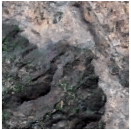 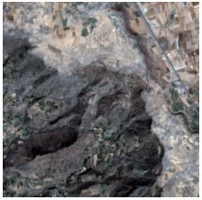

 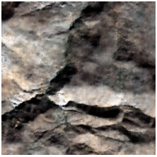 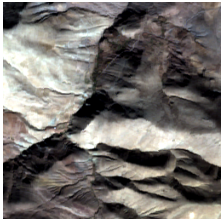

### Grassland

 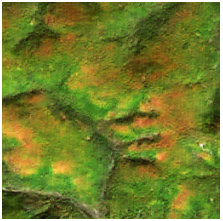 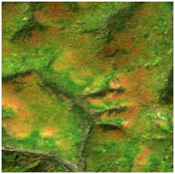

 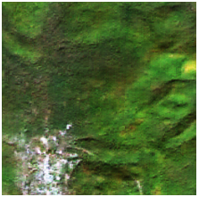 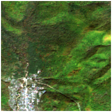

### Agricultural Land

 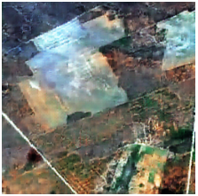 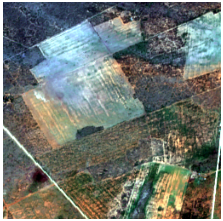

 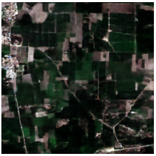 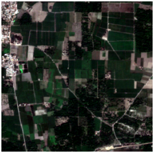

### Urban Area

 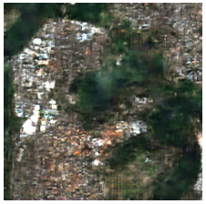 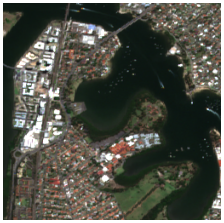

 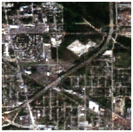 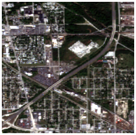
