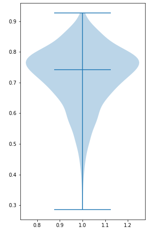
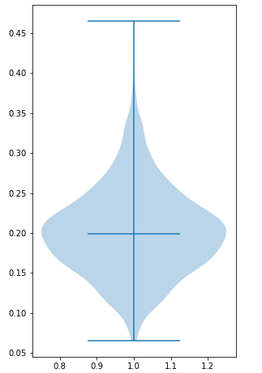
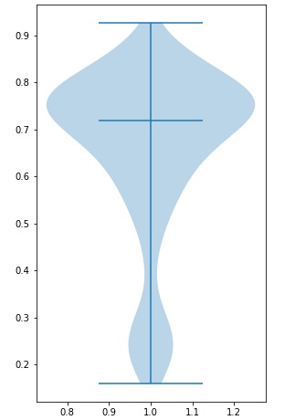
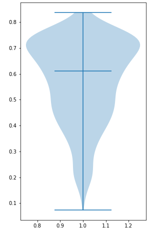

# shr0ud_kill3r
Generative model to produce optical satellite images from SAR images.

Cloud cover in satellite images is a major problem, causing either loss of information through obstruction (thick clouds), or blurry effects (semi-transparent/thin clouds). Failure to mask out clouds has a significant negative impact on subsequent analyses such as climate change assessment, land-use classification, crop-land monitoring in agriculture and disaster assessment. Here, we use a Conditional Generative Adversarial Network to leverage the advantages of radar images – which can penetrate cloud cover – and using them to reconstruct or generate corresponding optical (Red, Green and Blue band of visual spectrum) images, which can be easily inspected. We first establish a baseline performance with a benchmark cGAN like pix2pix and then discuss the disadvantages of trying a model-centric approach towards improving the performance and output quality of the model. We then take a data-centric approach and prepare the dataset with a new point of view, segregating it according to land cover type, to take advantage of common features and colour profiles among the images. This leads to a significant improvement in the quality of generated images which we have assessed using the structural similarity index. We then conclude with possible further improvements to our work and comments on the use of our work in the industry.

## Curated Dataset

We decided to segregate the data into four classes and then train separate conditional GANs specifically on those classes. We searched through images captured during the fall season in the original dataset, and selected images which could belong to each of the four classes: **barren land, grassland, agricultural land, and urban areas**. We selected 4,000 image pairs for each of the four classes, totalling to 16,000 image pairs. We then randomly split them up into training and testing sets, 80% of the images (3,200) in each class for training and the remaining 20% (800) for testing. We made 7 of these random splits using random seeds, trained and tested them, and then averaged out the results.

[Sentinel-1&2 Image Pairs (SAR & Optical)](https://www.kaggle.com/datasets/requiemonk/sentinel12-image-pairs-segregated-by-terrain)

## Results

Composite model (SAR classifier + cGAN) outputs, in order: __Sentinel-1 SAR (input), Generated (output), Sentinel-2 (ground truth)__

### Barren Land

  

  

### Grassland

  

  

### Agricultural Land

  

  

### Urban Area

  

  

We first tested the outputs of each of the generators separately i.e., without using the SAR classifier to feed images. Each generator was fed images from their specialized class. The SSIM scores of the 800 test images were plotted using a violin plot to show the distribution of SSIM scores, and also their median. A score of over 0.65 is considered good enough for our model. The horizontal line in the middle of the plot represents the median of the distribution.

 

 

As we can see, the SSIM distribution of urban areas is not desirable. This is because satellite images of urban areas (Figure 5.4) have an increased amount of detail as compared to other classes, with small objects and their boundaries. Not to mention, some urban areas contain elements of barren, grass and agricultural lands as well. In other words, the complexity of urban images is much greater as compared to images of the rest of the classes.

With the __composite model__, our classifier outputs a probability vector with probabilities assigned to each class for the input SAR image. The image is then fed into the generator of whichever class received the maximum score. Subsequently the SSIM scores and violin plots are generated as per the previous experiment.

 

 

We observe that the ends are no longer tapering and there is some bulge in lower range. This is due to the fact that the SAR classifier’s accuracy is 84.16% and some of the images have been misclassified and ended up in the wrong generator.

The most significant observation however, is that of the urban plot. Using the classifier has greatly improved our result with the median being just above 0.6. This confirms our theory of urban images having feature elements from other classes too. With this improvement we do not deem it necessary to increase the complexity of the urban generator model. Although, this could also point towards the refinement of our urban dataset.
